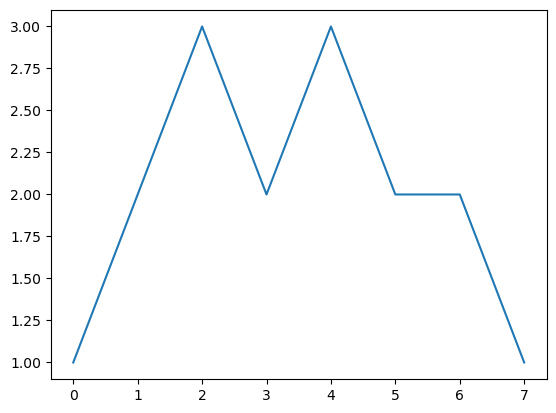
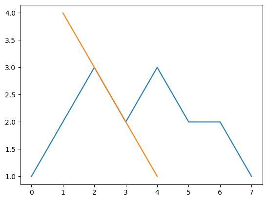
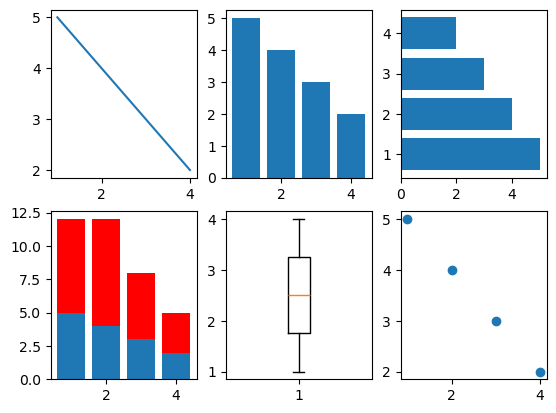

```python
%matplotlib inline
```

# 绘制并定制化图表

## 定义图表类型——柱状图、线形图和堆积柱状图

Matplotlib中的基本图表包括以下元素。
- x轴和y轴：水平和垂直的轴线。
- x轴和y轴刻度：刻度表示坐标轴的分隔，包括最小刻度和最大刻度。
- x轴和y轴刻度标签：表示特定坐标轴的值。
- 绘图区域：实际绘图的区域。


```python
from matplotlib.pyplot import *
plot([1,2,3,2,3,2,2,1]) 
```


    [<matplotlib.lines.Line2D at 0x7fe86779de50>]


    

    


现在，试着通过plot()的第一个参数添加x轴的值


```python
from matplotlib.pyplot import *
plot([1,2,3,2,3,2,2,1]) 
plot([4,3,2,1],[1,2,3,4])
```


    [<matplotlib.lines.Line2D at 0x7fe866d92210>]


    

    


让我们基于相同的数据集合多生成一些常见的图表来做一下比较。


```python
from matplotlib.pyplot import *

# some simple data
x = [1,2,3,4]
y = [5,4,3,2]
# create new figure
figure()

# divide subplots into 2 x 3 grid
# and select #1
subplot(231)
plot(x, y)

# select #2
subplot(232)
bar(x, y)

# horizontal bar-charts
subplot(233)
barh(x, y)

# create stacked bar charts
subplot(234)
bar(x, y)

# we need more data for stacked bar charts
y1 = [7,8,5,3]
bar(x, y1, bottom=y, color = 'r')

# box plot
subplot(235)
boxplot(x)

# scatter plot
subplot(236)
scatter(x,y)

show()
```


    

    


**工作原理**

通过调用figure()方法，我们创建出一个新的图表。如果给该 方法提供一个字符串参数，例如"sample charts"，这个字符串就 会成为窗口的后台标题。如果通过相同的参数（也可以是数字）调用 figure()方法，将会激活相应的图表，并且接下来的绘图操作都在 此图表中进行。 

接下来，调用subplot(231)方法把图表分割成2×3的网格。也 可以用subplot(3,2,1)这种形式来调用，第一个参数是行数，第二 个参数是列数，第三个参数表示图形的标号。 

接着用几个简单的命令创建垂直柱状图（bar()）和水平柱状图 （barh()）。对于堆叠柱状图，我们需要把两个柱状图方法调用连 在一起。通过设置参数bottom=y，把第二个柱状图和前一个柱状图 连接起来形成堆叠柱状图。 

通过调用boxplot()方法可以创建箱线图，图中的箱体从下四分 位数延伸到上四分位数，并带有一条中值线。

最后创建了一个散点图来让大家对基于点的数据集合有所了解。 当一个数据集合中有成千上万的数据点时，散点图很有可能就更合适 了。但这里，我们只是想举例说明相同数据集合的不同展示方式。


```python

```
